# 🎵 MoodyMusic – AI-Powered Mood-Based Spotify Music Recommender

MoodyMusic is an Android app that **recommends songs based on your mood**, powered by **Spotify**, **Google Gemini 2.0**, and **Firebase**. Users can track their emotional journey in a mood diary, create and manage playlists, and enjoy music tailored to their feelings. Input your mood by either speaking it or typing it out — the AI will do the rest.

---

## 🚀 Key Features

### 🎤 Voice & Text-Based Mood Detection

* Tap the microphone icon to **speak your mood** using **Google Speech-to-Text**.
* The spoken text appears in a **TextField**, where you can edit or manually type your mood.
* Tap the **search icon** to send your prompt to **Firebase**, where the **Gemini 2.0 Flash Model** analyzes it.
* Receive mood-based song or playlist recommendations, and automatically navigate to the **Songs screen**.

### 🎶 Mood-Based Music Recommendations

* Express your mood by:

  * Selecting an **emoji** on the Mood Screen, or
  * Typing or speaking your mood on the AI Screen.
* Songs are fetched from **Spotify** according to your detected mood.

### 🔑 Authentication & Secure Backend

* Sign up & log in with **Firebase Authentication**.
* Secure Spotify OAuth flow handled via a **Render-hosted Node.js backend**:

  * Exchanges the Spotify authorization code for an access token.
  * Includes a ping feature to wake up the Render backend before Spotify requests.

### 🎧 Playlist Creation & Management

* Browse Spotify recommendations based on your mood.
* Add/remove songs from **new or existing playlists**.
* View all saved playlists and their songs in the **Playlist screen**.

### 📊 Mood Diary & Export

* Save your daily moods to the **Diary**.
* Visualize mood trends:

  * Weekly
  * Monthly
  * Yearly
* Export your mood data as a **PDF report** for self-reflection.

---

## 🔧 Technology Stack

| Layer          | Tools & Frameworks                                       |
| -------------- | -------------------------------------------------------- |
| UI             | Jetpack Compose, Material3, Kotlin                       |
| Architecture   | MVVM, Kotlin Flows                                       |
| Authentication | Firebase Authentication                                  |
| Backend        | Render-hosted Node.js API for Spotify OAuth              |
| Database       | Firebase Firestore                                       |
| AI             | Gemini 2.0 Flash Model via Firebase Extension            |
| Music API      | Spotify Web API                                          |
| Additional     | Firebase Genkit for monitoring, PDF libraries for export |

---

## 🤖 Gemini Model Context

**Model Context:**
You are a music mood recommendation assistant. Given a user's spoken feeling or request, return the response as a raw JSON object **without markdown formatting**.

Example Prompt: *"I feel tired today."*

Example Response:

```json
{ "mood": "CALM", "recommendation": "Acoustic Chill" }
```

Supported moods:

```
["HAPPY", "SAD", "ANGRY", "CALM", "NEUTRAL", "ROMANTIC"]
```

---

## 🔐 Firebase Firestore Security Rules

```js
rules_version = '2';
service cloud.firestore {
  match /databases/{database}/documents {

    match /users/{userId} {
      allow read, write: if request.auth != null && request.auth.token.email == userId;

      match /playlists/{playlistId} {
        allow read, write: if request.auth != null && request.auth.token.email == userId;
      }

      match /moodLogs/{logId} {
        allow read, write: if request.auth != null && request.auth.token.email == userId;
      }
    }

    match /Moody_Bot/{userId} {
      allow read, write: if request.auth != null && request.auth.token.email == userId;
    }

  }
}
```

---

## 🌐 External Services

| Service        | Purpose                                   |
| -------------- | ----------------------------------------- |
| Spotify API    | Fetch songs/playlists, manage playlists   |
| Render Backend | Exchange authorization code for token     |
| Firebase       | Authentication, Firestore, AI integration |
| Gemini 2.0     | Mood detection and recommendation         |

---

## 🖼️ Screenshots

| Sign Up | Login | Mood Screen  | AI Screen | Spotify Songs | Playlist | Mood Diary & Insights | DRAWER AND BOTTOM SHEET
|--------|----------|------|--------|--------|
| 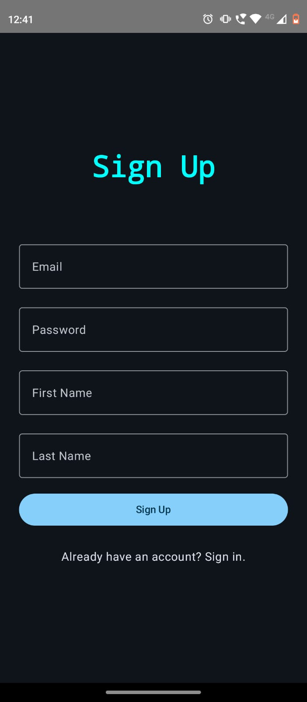 | 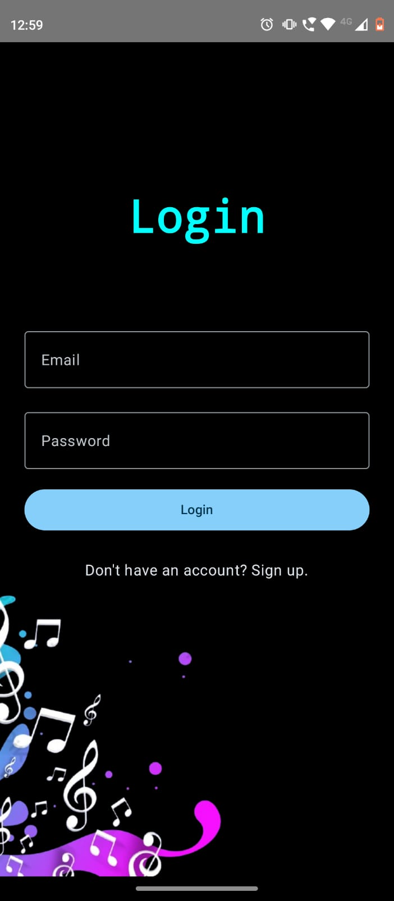 | 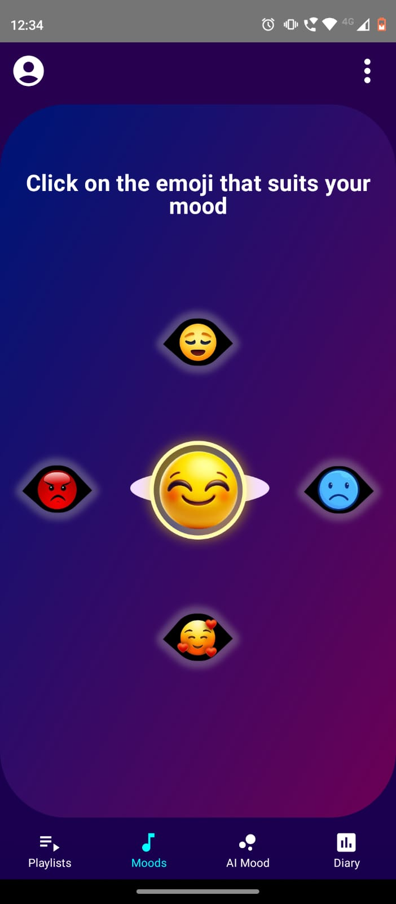 | 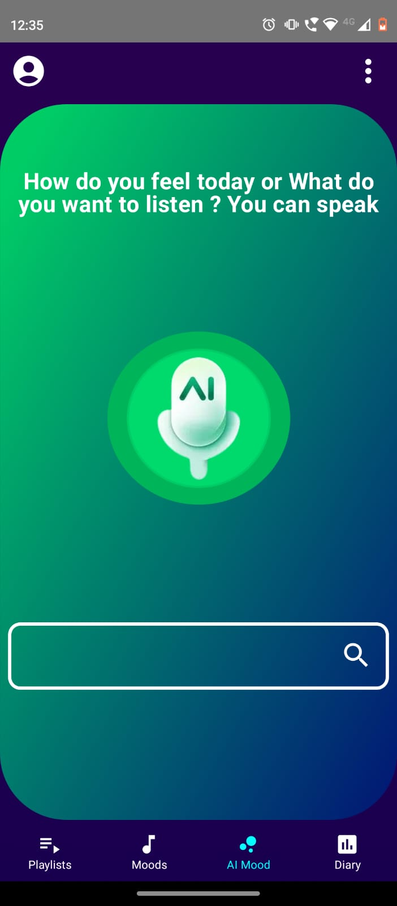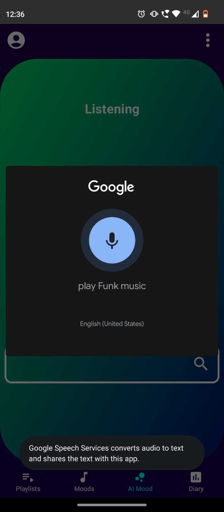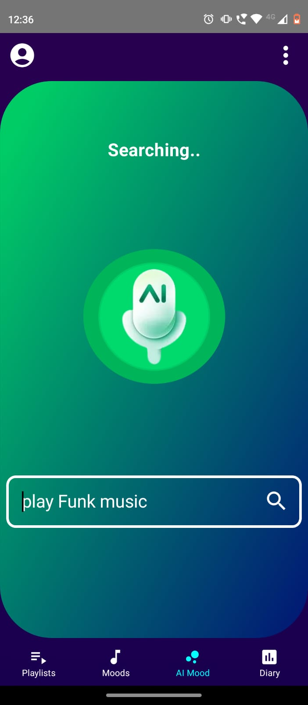 | 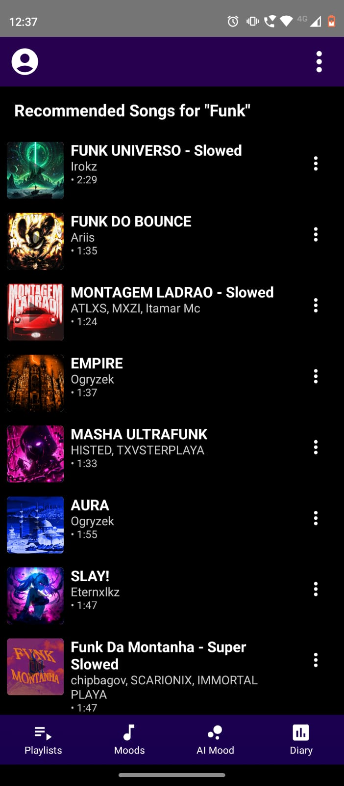 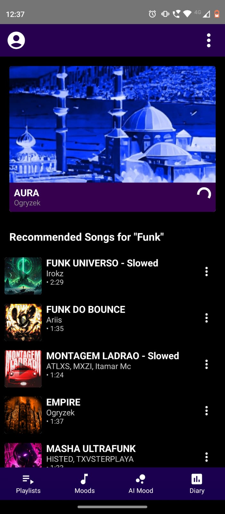 | 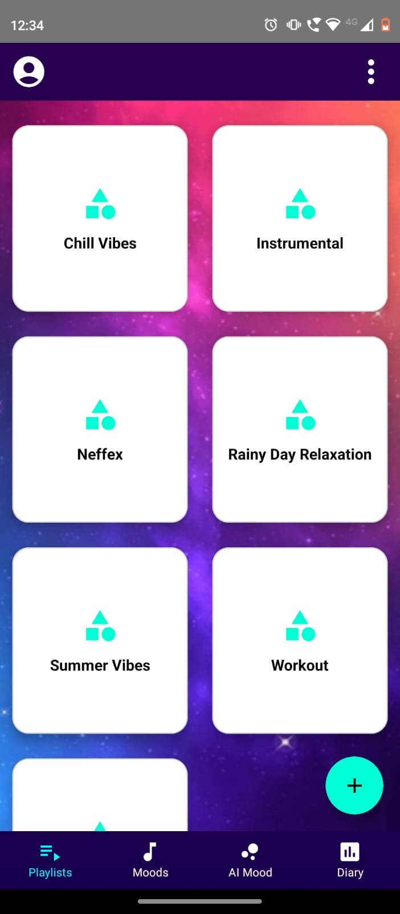 | 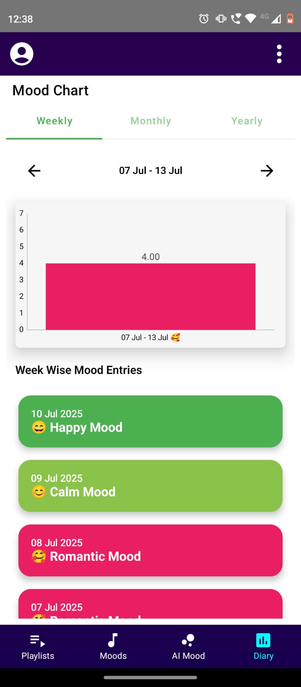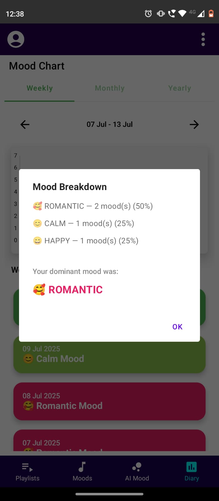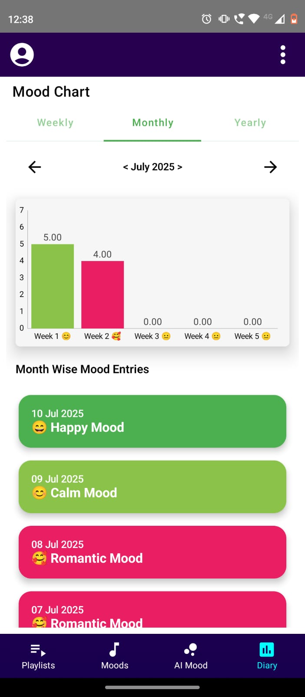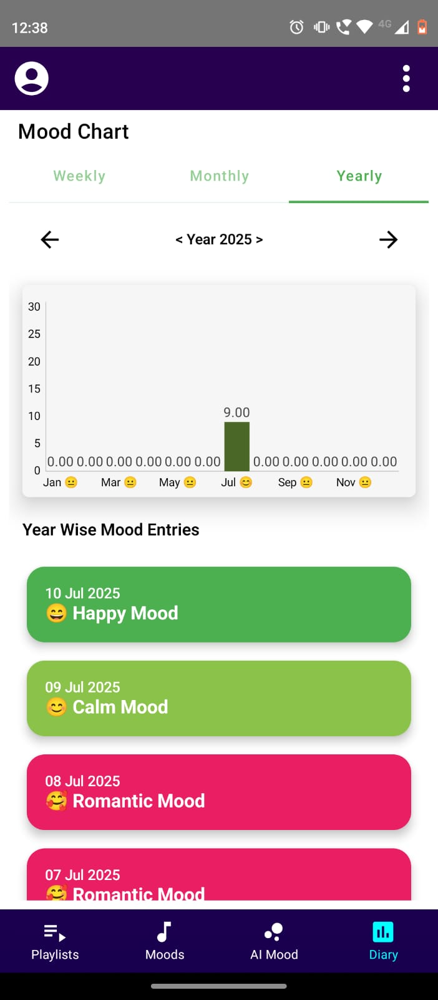 | 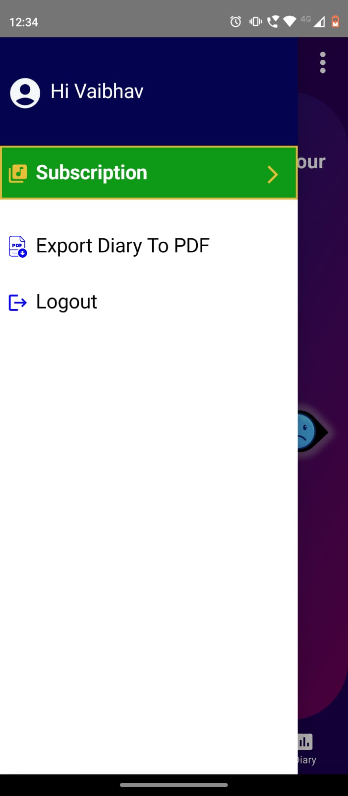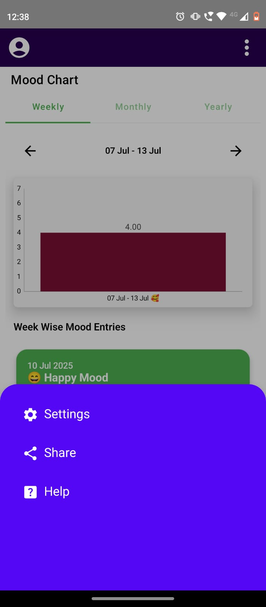

---
